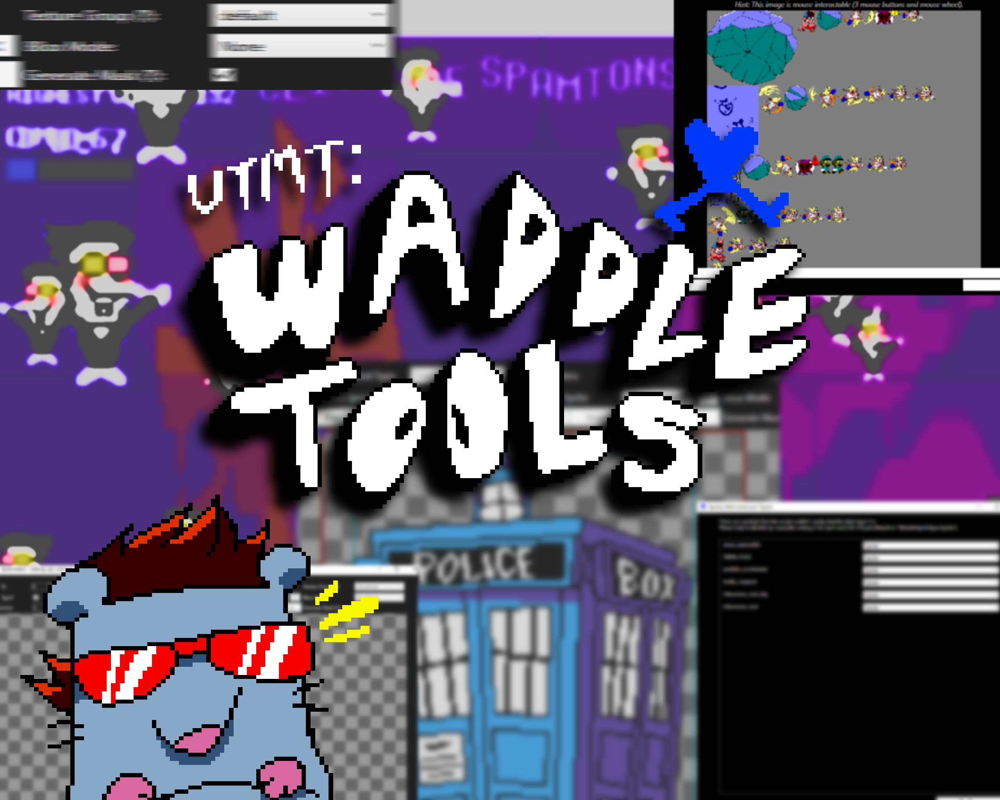
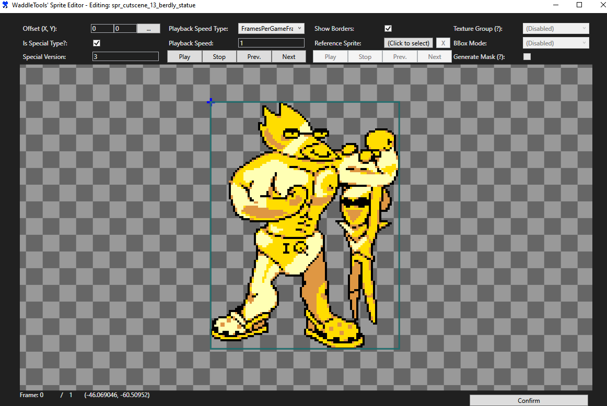
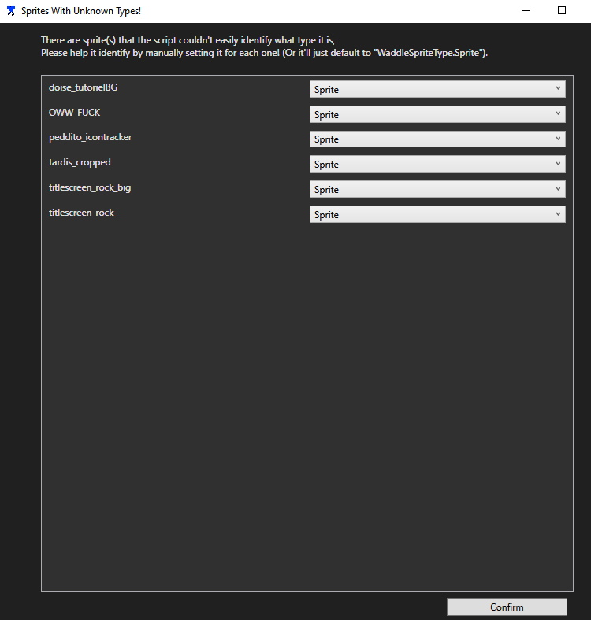
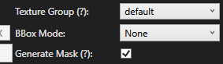

# Undertale Modding Tool: WaddleTools

Tools in .csx script made for my convenience. (hopefully for yours too!)

**NOTE:** These tools are made for my Pizza Tower modding endeavors and are *not that perfect* and could be buggy because i don't do C# that much *(even though this took like a million of revisions)*, that's why i put it on a repo! If you know you can help improve these, it would mean a lot! :)

## Scripts and their functionalities:
### SpriteEditorStandalone.csx:
Script that let's you edit sprites in an editor!
With a interactable interface inspired to GameMaker's Sprite Editor! \
*(Not the one where you can manually edit the image's pixels tho :P)*

(***PROTIP:*** Being in a sprite tab automatically launches the editor without prompting you to type a sprite name!)

### ImportGraphicsSharp.csx:
An advanced graphics importer script! An overhaul of the ImportGraphics offering more configurable options!

### ReduceTextures.csx (WORK IN PROGRESS! NOT INCLUDED IN ANY RELEASES!!):
Script meant to clean off unreferenced Embedded Textures or Page Items! \
*(Unused sprites was originally planned here but code referencing sprite as numbers bug things so grrrr that's why its put on hold for now unless I decided I'll not include a Unused Sprites Cleanup feature in it's release or someone else smarter than me figure it out...)*

# Extra Scripts! and what they showcase:
Not really useful for any modding endeavors, these are just made solely for testing what you can do in the scopes of being in a UTMT script.

**SpamtonScript.csx** - Click the spamton! *(REQUIRES DELTARUNE CHAPTER 2 TO BE LOADED OR ELSE IT'LL CONSTANTLY THROW A BUNCHA ERRORS)*

***NOTE: The following scripts may not work on specific UTMT versions especially outdated ones and I have no plans on ensuring compatibility on all versions since these aren't really useful for anything.***

## Undertale Modding Tool Version Compatibility List:
| Script | v.0.8.2 to v.0.8.4 | v.0.5.5 to v0.6.0.0 |
| --- | :---: | :---: |
| SpriteEditorStandalone.csx | ✔️ | ✔️ |
| ImportGraphicsSharp.csx | ✔️ | ✔️ |

feel free to add more versions in this list that are compatible with the tools!

## Setup:
1. Download the files as *.zip (get one at the releases page!)
2. Put the folder in a place of your liking. *(Make sure contents of the folder stays in tact! For UTMT loads scripts on a relative path manner.)*
3. Have fun toying with the tools!
